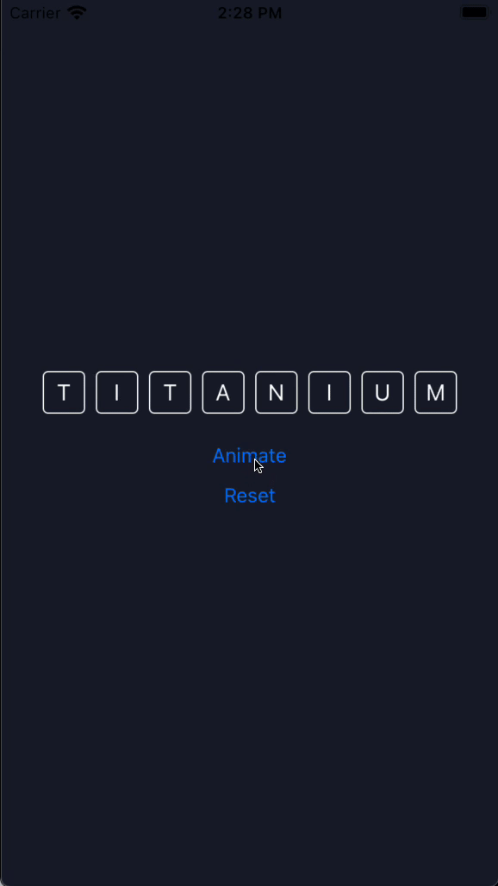
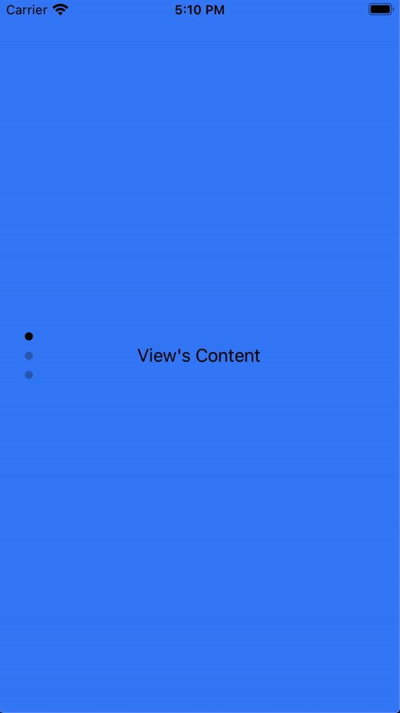
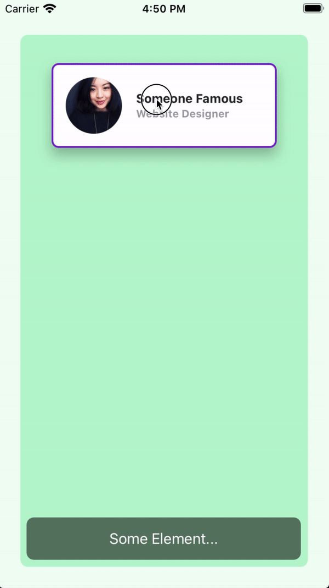
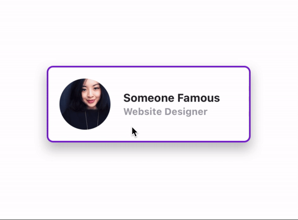

## The Animation Module
:::info
**PurgeTSS** includes an Animation module to apply simple 2D Matrix animations or transformations to any element or to an array of elements.
:::

- You can create as many `Animation` elements as you want.
- You can chain them with callback functions to create a sequence of animations.
- You can `play` the animation to a single element or an array of elements, like the children of a view for example.
- You can `apply` the properties instantly without animation.
- You can convert any View or an array of Views into draggable elements with the `draggable` method.
- You can use `drag:` and `drop:` modifiers to set different properties.
- You can set: `delay`, `duration`, `rotation`, `scaling`, `repetition`, `animation curve`.
- You can animate properties like *background color*, *opacity*, *width*, *height* and more.
- **You can set different properties to different states, using the modifiers `open:`, `close:` and `complete:`.**


## Instalation and Usage
Use the **`purgetss module`** command to install the module in your `lib` folder.

```bash
> purgetss module

# alias:
> purgetss m
```

:::info Usage
To use it, create an `Animation` element that will hold the transformation values. And set its `module` property to `module='purgetss.ui'`
:::

You can set any sizing, positioning and color properties available in `tailwind.tss`.


## The `play` method
- Use the `play` method in your controller to reproduce the animation by passing the element that you want to animate.
- You can call the method when opening the controller, after a click event, etc.

```typescript
$.myAnimation.play($.myView);
```

#### `play` example 1
Create an animation element and set the desired properties.

```xml title="index.xml"
<Alloy>
  <Window>
    <View id="square" class="w-16 h-16 bg-blue-500" />
    <Animation module="purgetss.ui" id="myAnimation" class="w-32 h-32 bg-green-500" />
  </Window>
</Alloy>
```

In the controller pass the element that you want to animate, in this case the `square` View.

```typescript title="index.js"
$.index.open();
$.myAnimation.play($.square);
```


***\* low framerate gif***


### `open` and `close` modifiers
You can create more complex animations by combining properties to different `states` like when `opening` or `closing` an animation.

#### `play` example 2

```xml title="index.xml"
<Alloy>
  <Window class="keep-screen-on">
    <View class="vertical">
      <Button class="w-48 mt-1 bg-purple-500 rounded ios:mt-16 text-purple-50" ios:onSingletap="do3Squares" android:onClick="do3Squares" title="3 Squares"/>
      <Button class="w-48 mt-2 bg-purple-500 rounded text-purple-50" ios:onSingletap="doChangeColors" android:onClick="doChangeColors" title="Toggle Colors"/>
      <Button class="w-48 mt-2 bg-purple-500 rounded text-purple-50" ios:onSingletap="doRetweet" android:onClick="doRetweet" title="Toggle Re-Tweet"/>

      <View id="squares" class="w-screen mt-10 vertical">
        <View id="aquare1" class="bg-blue-700 w-28 h-28 rounded-xl" />
        <View id="aquare2" class="mt-4 bg-blue-700 w-28 h-28 rounded-xl" />
        <View id="aquare3" class="mt-4 bg-blue-700 w-28 h-28 rounded-xl" />
      </View>
    </View>

    <View id="square3" class="mt-8 bg-blue-500 w-14 h-14 rounded-xl" ios:onSingletap="doTransparency" android:onClick="doTransparency" />

    <View id="retweetView" class="w-screen h-48 bg-gray-800 vertical -mb-52 rounded-2xl" ios:onSingletap="doRetweet" android:onClick="doRetweet">
      <View class="w-8 h-1 mt-4 bg-slate-700" />

      <View class="mx-4 mt-4 horizontal">
        <Label class="text-xl text-slate-500 fas fa-retweet w-7" />
        <Label class="ml-2 text-xl text-left text-white" text="Re-Tweet" />
      </View>

      <View class="mx-4 mt-4 horizontal">
        <Label class="text-xl text-slate-500 fas fa-pencil-alt w-7" />
        <Label class="ml-2 text-xl text-left text-white" text="Quote Tweet" />
      </View>
    </View>

    <Animation id="squaresWidth" class="ease-out delay-50 open:w-11/12 close:w-28 debug" module="purgetss.ui" />
    <Animation id="transparency" class="open:duration-150 close:duration-300 open:mt-(null) close:mt-8 open:w-10/12 open:h-11/12 close:w-14 close:h-14 open:opacity-50 close:opacity-100" module="purgetss.ui" />
    <Animation id="retweet" class="open:duration-200 close:duration-150 open:-mb-16 close:-mb-52" module="purgetss.ui" />
    <Animation id="changeColor" class="delay-25 open:bg-purple-500 close:bg-blue-700 debug" module="purgetss.ui" />
  </Window>
</Alloy>
```

```typescript title="index.js"
function doTransparency(e) {
  $.transparency.play($.square3);
}

function doChangeColors(e) {
  $.changeColor.play($.squares.children);
}

function do3Squares(e) {
  $.squaresWidth.play($.squares.children);
}

function doRetweet(e) {
  $.retweet.play($.retweetView);
}

$.index.open();
```


***\* low framerate gif***


### `complete` modifier
- The animation module will execute the properties defined in the `complete` modifier.

#### `complete` example 1
In this example the `open` animation will reduced the children of the `letters` view to a size of 1%, after completion, the `complete` modifier will be executed: Setting the background color to green and the scaling back to 100%.

```xml title="index.xml"
<Alloy>
  <Window title="App Wordle" class="bg-(#181e2d)">
    <View class="vertical">
      <View id="letters" class="horizontal">
        <Label class="w-8 h-8 mx-1 text-center text-white bg-transparent border-white rounded" text="T" />
        <Label class="w-8 h-8 mx-1 text-center text-white bg-transparent border-white rounded" text="I" />
        <Label class="w-8 h-8 mx-1 text-center text-white bg-transparent border-white rounded" text="T" />
        <Label class="w-8 h-8 mx-1 text-center text-white bg-transparent border-white rounded" text="A" />
        <Label class="w-8 h-8 mx-1 text-center text-white bg-transparent border-white rounded" text="N" />
        <Label class="w-8 h-8 mx-1 text-center text-white bg-transparent border-white rounded" text="I" />
        <Label class="w-8 h-8 mx-1 text-center text-white bg-transparent border-white rounded" text="U" />
        <Label class="w-8 h-8 mx-1 text-center text-white bg-transparent border-white rounded" text="M" />
      </View>

      <Button class="mt-4" android:onClick="doAnimate" ios:onSingletap="doAnimate">Animate</Button>
      <Button android:onClick="doReset" ios:onSingletap="doReset">Reset</Button>
    </View>

    <Animation module="purgetss.ui" id="myAnimationReset" class="bg-transparent" />
    <Animation module="purgetss.ui" id="myAnimationOpen" class="open:scale-1 complete:bg-(#008800) complete:scale-100" />
  </Window>
</Alloy>
```

```typescript title="index.js"
$.index.open();

function doAnimate() {
  $.myAnimationOpen.play($.letters.children);
}

function doReset() {
  $.myAnimationReset.apply($.letters.children);
}
```



## The `apply` method
- Use `apply` when you need to immediately apply the properties and transformations to the view.

```typescript title="index.js"
$.myAnimation.apply($.myView);
```

#### example 1
The following example `applies` the properties to prevent the animation from showing.

The method `apply` sets the properties instantly. In this example, the `ScrollableView` is rotated 90 degrees, and its content is counter rotated -90 degrees.

```xml title="index.xml"
<Alloy>
  <Window class="dont-exit-on-close keep-screen-on">
    <ScrollableView id="scrollableView" class="overlay-enabled disable-bounce paging-control-alpha-100 scrolling-enabled show-paging-control paging-control-h-14 paging-control-on-bottom paging-control-transparent page-indicator-(rgba(0,0,0,0.24)) current-page-indicator-(rgba(0,0,0,1))">
      <View id="elView1" class="bg-blue-500">
        <Label class="text-center" text="View's Content" />
      </View>

      <View id="elView2" class="bg-red-500">
        <Label class="text-center" text="View's Content" />
      </View>

      <View id="elView3" class="bg-green-500">
        <Label class="text-center" text="View's Content" />
      </View>
    </ScrollableView>

    <Animation module="purgetss.ui" id="rotate" class="rotate-90 inverted-platform-w inverted-platform-h" />
    <Animation module="purgetss.ui" id="counterRotate" class="-rotate-90 platform-w platform-h" />
  </Window>
</Alloy>
```

```typescript title="index.js"
$.index.open();
$.rotate.apply($.scrollableView);
$.counterRotate.apply($.scrollableView.views);
```



***\* low framerate gif***


## The `draggable` method
- You can convert any View or an array of Views into draggable elements by using the `draggable` method.
- You can set **basic animations** when dragging or dropping elements with the modifiers `drag:` and `drop:`.
- You can `apply` or `animate` the animations either globally or locally with the `draggingType` property.
- You can constraint any View with `horizontal-constraint` or `vertical-constraint` classes.

```typescript Calling a draddable method
$.draggableAnimation.draggable('A View or an array of Views');
```

:::info
**You can use any `Animation` object created in your View to use the `draggable` method.**

**But by using one Animation on a set of Views, it will handle the zIndex of every draggable element automatically.**
:::

#### draggable example
```xml title="index.xml"
<Alloy>
  <Window class="keep-screen-on dont-exit-on-close">
    <View id="red" class="w-32 h-32 ml-4 bg-red-500 rounded-lg" />

    <View id="green" class="w-32 h-32 ml-10 bg-green-500 rounded-lg" />

    <View id="blue" class="w-32 h-32 ml-16 bg-blue-500 rounded-lg" />
  </Window>

  <Animation id="draggableAnimation" module="purgetss.ui" />
</Alloy>

```

```typescript title="index.js"
$.index.open();

$.draggableAnimation.draggable([$.red, $.green, $.blue]);
```


***\* low framerate gif***


### `drag` and `drop` modifiers
- You can set basic animations while dragging and dropping elements.
- You can create an `Animation` element with a “global” set of modifiers or you can set modifiers separately to each view.
- Local modifiers will overwrite any global modifier.

:::info
To simplify things... We are restricting the type of animations that can be apply while dragging ( or dropping ).

**Mainly we are not applying any `size`, `scale` or `anchorPoint` transformation.**
:::

#### drag & drop example
```xml {3,6,9,12} title="index.xml"
<Alloy>
  <Window class="keep-screen-on dont-exit-on-close">
    <!-- No local modifiers, will be using the global modifiers -->
    <View id="red" class="w-32 h-32 ml-4 bg-red-500 rounded-lg" />

    <!-- Local modifiers: drag:bg-green-700 drop:bg-green-500 plus the global modifiers-->
    <View id="green" class="w-32 h-32 ml-10 bg-green-500 rounded-lg drag:bg-green-700 drop:bg-green-500" />

    <!-- Local modifiers: overwriting the global opacity to drag:opacity-80 -->
    <View id="blue" class="w-32 h-32 ml-16 bg-blue-500 rounded-lg drag:opacity-80" />

    <!-- Global set of modifiers -->
    <Animation id="draggableAnimation" module="purgetss.ui" class="drag:duration-100 drag:opacity-50 drop:opacity-100" />
  </Window>
</Alloy>
```


***\* low framerate gif***


### `draggingType` property
- For controlling how `drag:` and `drop:` modifiers are applied, either by animating: `drag-animate` ( *default* ) or by applying: `drag-apply` the properties.

```scss title="tailwind.tss"
// Component(s): For the Animation Component
// Property(ies): draggingType
'.drag-apply': { draggingType: 'apply' }
'.drag-animate': { draggingType: 'animate' }
```

#### draggingType example
In the following example, the `Animation` element is setting the global dragging type to `drag-apply`, but the green square is overwriting it to `drag-animate`.

```xml {3,6,9,12} title="index.xml"
<Alloy>
  <Window class="keep-screen-on dont-exit-on-close">
    <!-- No local modifiers, will be using the global modifiers -->
    <View id="red" class="w-32 h-32 ml-4 bg-red-500 rounded-lg" />

    <!-- Local modifiers: drag:bg-green-700 drop:bg-green-500 plus the global modifiers-->
    <View id="green" class="w-32 h-32 ml-10 bg-green-500 rounded-lg drag-animate drag:bg-green-700 drop:bg-green-500" />

    <!-- Local modifiers: overwriting the global opacity to drag:opacity-80 -->
    <View id="blue" class="w-32 h-32 ml-16 bg-blue-500 rounded-lg drag:opacity-80" />

    <!-- Global set of modifiers -->
    <Animation id="draggableAnimation" module="purgetss.ui" class="drag-apply drag:duration-500 drag:opacity-50 drop:opacity-100" />
  </Window>
</Alloy>
```


***\* low framerate gif***


### `bounds` modifier
- You can set boundaries in which the View can move within its parent View.
- You can set global boundaries and/or local boundaries to each individual View.
- Local values will overwrite any global values.

#### bounds example 1
The `card` view has a boundary of `m-4` and a bottom boundary of `mb-16`.

```xml title="index.xml"
<Alloy>
  <Window class="keep-screen-on dont-exit-on-close bg-green-50">
    <View class="w-screen h-screen mx-6 mt-10 mb-6 bg-green-200 rounded-lg">
      <View id="card" class="w-64 h-24 mt-8 shadow-lg bounds:m-2 bounds:mb-16">
        <View id="cardInside" class="w-screen bg-white border-2 border-purple-700 rounded-lg ">
          <ImageView id="theImage" class="w-16 h-16 m-4 ml-4 rounded-16 prevent-default-image bg-gray-50" image="https://randomuser.me/api/portraits/women/17.jpg" />

          <View class="w-screen ml-24 vertical">
            <Label class="ml-0 text-sm font-bold text-gray-800" text="Someone Famous" />
            <Label class="ml-0 text-xs font-bold text-gray-400" text="Website Designer" />
          </View>
        </View>
      </View>

      <Label class="mx-2 mb-2 h-12 rounded-lg text-white text-center w-screen bg-(#80000000)" text="Some Element..." />
    </View>

    <Animation id="draggableAnimation" module="purgetss.ui" />
  </Window>
</Alloy>
```

```typescript title="index.js"
$.index.open();

$.draggableAnimation.draggable($.card);
```



***\* low framerate gif***


#### bounds example 2
In this example, the boundaries are set globally in the `draggableAnimation` view.

Every card view will use the global values.

```xml title="index.xml"
<Alloy>
  <Window class="keep-screen-on dont-exit-on-close bg-green-50">
    <View class="w-screen h-screen mx-6 mt-10 mb-6 bg-green-200 rounded-lg">
      <View id="card" class="w-64 h-24 mt-8 shadow-lg">
        <View id="cardInside" class="w-screen bg-white border-2 border-purple-700 rounded-lg ">
          <ImageView id="theImage" class="w-16 h-16 m-4 ml-4 rounded-16 prevent-default-image bg-gray-50" image="https://randomuser.me/api/portraits/women/17.jpg" />

          <View class="w-screen ml-24 vertical">
            <Label class="ml-0 text-sm font-bold text-gray-800" text="Someone Famous" />
            <Label class="ml-0 text-xs font-bold text-gray-400" text="Website Designer" />
          </View>
        </View>
      </View>

      <View id="card2" class="w-64 h-24 mt-40 shadow-lg">
        <View id="cardInside" class="w-screen bg-white border-2 border-purple-700 rounded-lg ">
          <ImageView id="theImage" class="w-16 h-16 m-4 ml-4 rounded-16 prevent-default-image bg-gray-50" image="https://randomuser.me/api/portraits/women/21.jpg" />

          <View class="w-screen ml-24 vertical">
            <Label class="ml-0 text-sm font-bold text-gray-800" text="Second Famous" />
            <Label class="ml-0 text-xs font-bold text-gray-400" text="Website Designer" />
          </View>
        </View>
      </View>

      <View id="card3" class="w-64 h-24 shadow-lg mt-72">
        <View id="cardInside" class="w-screen bg-white border-2 border-purple-700 rounded-lg ">
          <ImageView id="theImage" class="w-16 h-16 m-4 ml-4 rounded-16 prevent-default-image bg-gray-50" image="https://randomuser.me/api/portraits/women/25.jpg" />

          <View class="w-screen ml-24 vertical">
            <Label class="ml-0 text-sm font-bold text-gray-800" text="Third Famous" />
            <Label class="ml-0 text-xs font-bold text-gray-400" text="Website Designer" />
          </View>
        </View>
      </View>

      <Label class="mx-2 mb-2 h-12 rounded-lg text-white text-center w-screen bg-(#80000000)" text="Some Element..." />
    </View>

    <Animation id="draggableAnimation" module="purgetss.ui" class="bounds:m-2 bounds:mb-16" />
  </Window>
</Alloy>
```

```typescript title="index.js"
$.index.open();

$.draggableAnimation.draggable([$.card, $.card2, $.card3]);
```


***\* low framerate gif***


### `vertical` and `horizontal` constraints
- Add a vertical and horizontal constraint to any `dragging` element by setting the `vertical-constraint` or `horizontal-constraint` classes to the View.

```scss
// Component(s): Ti.UI.Animation
// Property(ies): A custom property to use it with the Animation module
'.horizontal-constraint': { constraint: 'horizontal' }
'.vertical-constraint': { constraint: 'vertical' }
```

#### Constraint example
In this example the `card` View will move only from side to side.

```xml title="index.xml"
<Alloy>
  <Window class="keep-screen-on dont-exit-on-close">
    <View id="card" class="w-64 h-24 shadow-lg horizontal-constraint">
      <View id="cardInside" class="w-screen bg-white border-2 border-purple-700 rounded-lg">
        <ImageView id="theImage" class="w-16 h-16 m-4 ml-4 rounded-16" image="https://randomuser.me/api/portraits/women/17.jpg" />

        <View class="w-screen ml-24 vertical">
          <Label class="ml-0 text-sm font-bold text-gray-800" text="Someone Famous" />
          <Label class="ml-0 text-xs font-bold text-gray-400" text="Website Designer" />
        </View>
      </View>
    </View>

    <Animation id="draggableAnimation" module="purgetss.ui" />
  </Window>
</Alloy>
```

```typescript title="index.js"
$.index.open();

$.draggableAnimation.draggable($.card);
```



***\* low framerate gif***
